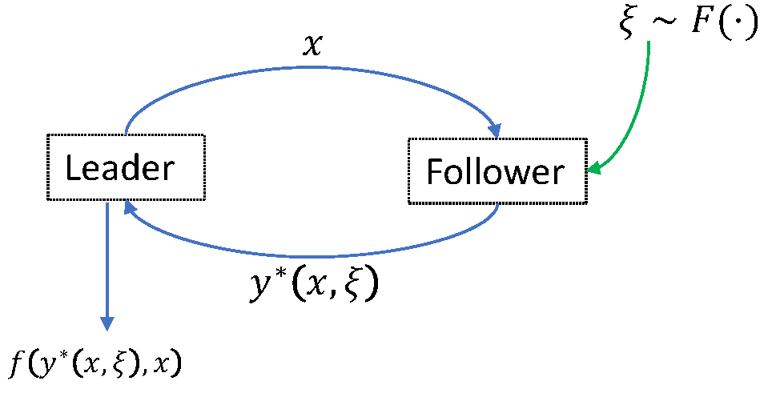

# Distributionally-Robust-Bilevel-Optimization
* **Paper**: Goyal, A., Zhang, Y., & He, C. (2023). Decision Rule Approaches for Pessimistic Bilevel Linear Programs Under Moment Ambiguity with Facility Location Applications. INFORMS Journal on Computing. [https://doi.org/10.1287/ijoc.2022.0168](https://doi.org/10.1287/ijoc.2022.0168)

**Guidelines for running the code.**
* Set working directory for MATLAB and Python as the folder containing these code files.

	* For computational time and gap results, run MATLAB file 'RunMain_GapTimeResults.m'

	* For in-sample objective results and sensitivity plots, 'ksi_in-sample.csv' generated from Uniform[30,240] is used.

	   Run in following order  
		a) run MATLAB file 'RunMain_InSampleResults.m'  
		b) run Python files 'plots_code_1.py', 'plots_code_2.py'

	* For out-of-sample results and box plots, for each (gamma1, gamma2) pair:  
	   i)  100 randomizations (with 10 samples each) of in-sample data generated inside file 'out_of_sample_obj.m' from Uniform[30,240].  
	   ii) The out-of-sample performance of solution obtained from each of the 100 randomizations of in-sample data is evaluated on fixed 
	       10 randomizations of out-of-sample data (with 5000 samples each) generated inside file 'GenResults_OutofSample.m'.   
	       
	   The distributions considered for out-of-sample tests are:   
		* True: Uniform[30,240],   
		* Misspecified:  1. Uniform[30,218],  2. Truncated Normal on [30,240] with mean = 135 and variance = 3675.
	   
	   Run in following order  
		a) run MATLAB file 'RunMain_OutofSampleResults.m' (takes very long time to run so don't run unnecessarily)  
		b) run Python file 'boxplots_code.py'
